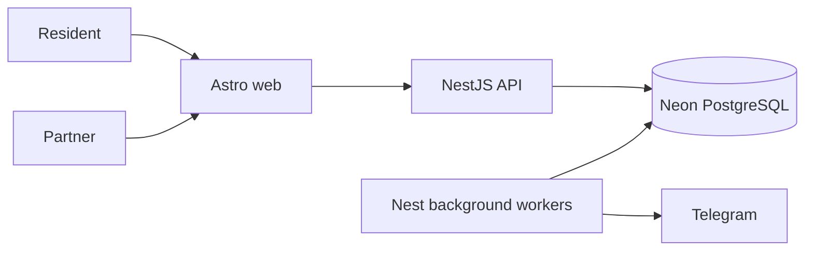
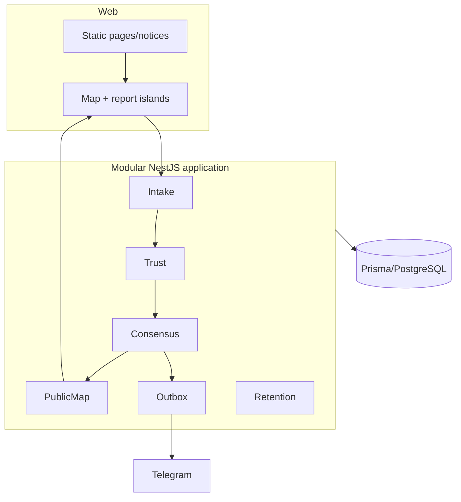
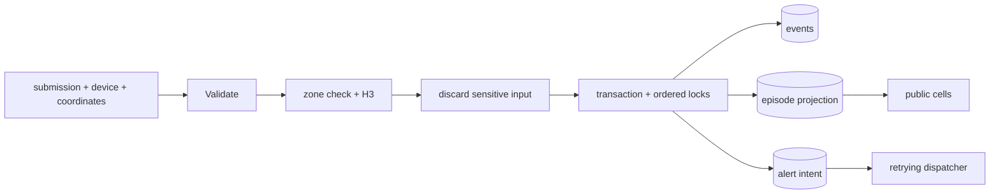

# Design: Community Outage MVP

## Technical Approach

Build an npm-workspace modular monolith: Astro serves static pages plus map/report islands; NestJS owns validation, H3 normalization, trust, consensus, projections, retention, and delivery. PostgreSQL is the consistency boundary. Immutable events, a serialized episode projection, and a transactional outbox satisfy all five specs. Because no application exists, every proposed dependency and command is an architecture target that scaffolding must verify.





## Architecture Decisions

| Decision | Choice | Rejected alternative / rationale |
|---|---|---|
| Consistency | One PostgreSQL transaction; acquire deterministic advisory locks for each `cell+service` in sorted order | Read-time aggregation cannot identify a single threshold crossing; ordered locks prevent multi-service deadlocks. |
| State | Immutable `ReportEvent` plus `OutageEpisode` projection | Projection-only loses evidence; event-only makes lifecycle and public reads race-prone. |
| Delivery | `AlertIntent` transactional outbox, claimed with leases/`SKIP LOCKED`; at-least-once Telegram attempts | Calling Telegram in intake couples acceptance to provider failure. |
| Privacy | HMAC-SHA-256 device token with key version; canonical request hash after H3 conversion | Raw UUID storage violates the privacy spec; an unkeyed hash is enumerable. |
| Runtime | Long-running Nest deployment runs bounded dispatch, expiry, and retention schedules | Serverless request handlers cannot guarantee post-request work. |

## Data Flow



```mermaid
sequenceDiagram
  participant C as Client
  participant I as Intake
  participant D as PostgreSQL
  participant W as Worker
  participant T as Telegram
  C->>I: POST /v1/reports
  I->>I: validate zone, derive H3, HMAC device, scrub input
  I->>D: BEGIN; lock sorted cell/service keys
  I->>D: idempotency check; events; quorum; episode; intent
  D-->>I: COMMIT
  I-->>C: stable acceptance result
  W->>D: claim pending intent
  W->>T: send privacy-safe opening alert
  W->>D: delivered or retryable
```

Expiry workers lock the same aggregate key before closure; `GET /cells` also requires `expiresAt > now`, so a delayed sweep never publishes stale state.

## Planned Files

| Path | Action | Responsibility |
|---|---|---|
| `apps/web/src/pages/` and `apps/web/src/components/islands/` | Create | Static shell/notices; map and form islands. |
| `apps/api/src/reports/` | Create | DTO, idempotency, atomic expansion. |
| `apps/api/src/trust/` | Create | HMAC, rate limit, movement, eligibility. |
| `apps/api/src/consensus/` | Create | Quorum policy, locks, episode lifecycle. |
| `apps/api/src/public-map/` | Create | Suppressed aggregate query. |
| `apps/api/src/alerts/` | Create | Outbox and Telegram adapter. |
| `apps/api/src/retention/` | Create | Name erasure and record deletion. |
| `apps/api/prisma/schema.prisma` | Create | Enums, constraints, indexes, models. |
| `packages/contracts/` | Create | Shared public request/response schemas only. |

## Interfaces / Contracts

`POST /v1/reports` accepts `{submissionId, deviceId, services[1..3], status, latitude, longitude, name?}` and returns `{submissionId, accepted}`; identical retries return the same body, conflicting reuse returns `409`. `GET /v1/cells?service=` returns only `{h3Cell, service}` for unexpired active quorums. `GET /v1/zones/:slug/notice` returns a printable, zone-safe document.

Planned Prisma models: `SubmissionRecord` (30-day idempotency/rate history), `ReportEvent` (7-day immutable evidence), `OutageEpisode` (aggregate projection), `AlertIntent` (unique `episodeId+OPENED`, delivery state), and `PilotZone` configuration. Display name is isolated for 24-hour erasure. No coordinate column exists.

## Testing Strategy

| Layer | Proof |
|---|---|
| Unit | Validation, canonical hashes, HMAC, quorum/lifecycle clocks, sanitization, alert content. |
| Integration | Real PostgreSQL transactions: concurrent threshold, ordered multi-service locks, uniqueness, retry claims, retention. |
| E2E | Report-to-map and report-to-outbox flows; Telegram fake; disabled rollout and privacy response snapshots. |

Scaffolding must first prove workspace scripts, Prisma migrations against PostgreSQL, unit/integration/E2E runners, lint, type-check, build, and CI; then update `openspec/config.yaml` with verified commands.

## Threat Matrix

N/A — no routing, shell, subprocess, VCS/PR automation, executable-file classification, or process-integration boundary is introduced.

## Migration / Rollout

No legacy migration. Deploy schema with intake, publication, and dispatch disabled; configure two or three approved zones, H3 resolution, HMAC secret, and Telegram credentials; run concurrency/privacy smoke tests; enable read path, then intake, then dispatch. Rollback disables intake/dispatch, cancels pending intents, serves the empty map and notice, and retains deletion schedules.

## Open Questions

- [ ] Approve named pilot zones and H3 resolution.
- [ ] Validate `60 min / 3 devices / 6 h` policy and retention defaults.
- [ ] Choose Railway or Fly.io and Cloudflare Pages or Vercel during scaffolding.
