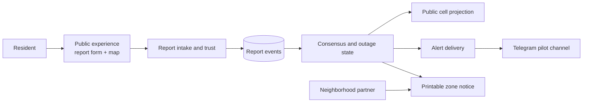

## Exploration: Community outage MVP architecture

### Current State

The workspace is planning-only: there is no application code, database, or test infrastructure. The source brief defines an Astro client, a NestJS API, PostgreSQL/Prisma, H3 aggregation, community consensus, and outbound alerts. It also contains three correctness gaps that must be resolved before implementation: the form is multi-service while `Report` stores one service, state is described as derived while alert threshold crossings require durable concurrency control, and optional names plus stable device identifiers make the claim of collecting no identifiable data too broad.



Primary actors are a reporting resident, a map visitor, a neighborhood partner distributing the printable notice, and an operator monitoring abuse and failed alert deliveries. The core capabilities are report intake, privacy-preserving geospatial normalization, trust/abuse evaluation, consensus projection, public state delivery, and outbound notification.

### Affected Areas
- `alertas-cortes-lima.md` — source brief whose unresolved product and data semantics need to become normative specifications.
- `openspec/config.yaml` — already establishes privacy, temporal, idempotency, concurrency, and diagram requirements for later SDD phases.
- `openspec/changes/define-community-outage-mvp/exploration.md` — records the conceptual baseline and decisions recommended for proposal.
- Future frontend, API, persistence, and delivery modules — do not exist yet; their boundaries should follow the capabilities above rather than the tentative folder sketch in the brief.

### Approaches
1. **Literal stateless aggregation** — store one event per service, calculate consensus on reads, and call the channel provider during `POST /reports`.
   - Pros: Few tables, smallest initial implementation, matches the brief literally.
   - Cons: Concurrent requests can observe the same threshold crossing and duplicate alerts; provider failures couple report acceptance to delivery; outage episodes and restoration transitions are difficult to identify deterministically.
   - Effort: Low initially, High once correctness failures appear.

2. **Event log with durable outage projection and alert outbox** — keep immutable report events, update one serialized cell/service episode projection, and create a unique alert intent in the same transaction.
   - Pros: Deterministic transitions, concurrency-safe consensus, idempotent alert creation, fast public reads, and an auditable privacy-retention boundary.
   - Cons: Adds projection and outbox tables plus retry/cleanup responsibilities; deliberately revises the brief's “no confirmed cells table” assumption.
   - Effort: Medium.

3. **Event-stream architecture** — publish reports to a broker and build consensus, maps, and notifications as independent consumers.
   - Pros: Strong separation, replayability, and future scale.
   - Cons: Broker operations, eventual consistency, and delivery complexity are disproportionate for a two-to-three-zone weekend pilot.
   - Effort: High.

### Recommendation

Use **Approach 2** as a modular monolith. It is the smallest architecture that makes the public state and alerts correct under concurrent submissions without introducing distributed infrastructure.

#### Domain and data baseline

| Concern | Recommended baseline |
| --- | --- |
| Multi-service input | Treat one form submission as a command with `1..3` distinct services. Expand it transactionally into one report event per service, linked by `submissionId`. Count rate limits per submission and consensus per service. |
| Request idempotency | Require a client-generated `submissionId`; enforce uniqueness per pseudonymous device and service so request retries cannot add votes. |
| Device identity | Never store the browser UUID raw. Store a server-keyed HMAC token; document that it remains pseudonymous tracking data, not anonymous data. |
| Location | Validate raw coordinates against the configured pilot boundary, derive H3 server-side, and discard coordinates before persistence, logs, traces, errors, or alert payloads. |
| Consensus | Count at most one eligible vote per device, cell, service, status, and consensus window. Silently excluded events may be retained only in the restricted abuse store and never affect public counts. |
| State | Serialize updates per `h3Cell + serviceType` using a row lock or PostgreSQL advisory transaction lock; persist the current episode/version as a projection while retaining report events as evidence. |
| Alerts | Insert an `AlertIntent` with a unique transition key inside the state transaction. Dispatch after commit, retry failures from the durable outbox, and use the intent ID as the provider idempotency key where supported. |

Use provisional, explicit temporal defaults in the proposal: a **60-minute rolling consensus window**, **three distinct eligible devices** for both `CORTE` and `RESTABLECIDO`, and a **six-hour active lifetime**. A `CORTE` quorum opens an episode. A later `CORTE` quorum refreshes its six-hour expiry but does not emit another opening alert. A `RESTABLECIDO` quorum after the opening transition closes it immediately. If neither quorum occurs again, the episode expires six hours after its last qualifying `CORTE` quorum. Lone reports never become public state and never extend an episode. Expiry is a neutral stale state, not proof that service was restored.

```mermaid
stateDiagram-v2
  [*] --> Unconfirmed
  Unconfirmed --> Active: 3 eligible CORTE devices / 60 min
  Active --> Active: new CORTE quorum / refresh expiry
  Active --> Restored: 3 eligible RESTABLECIDO devices after opening
  Active --> Expired: 6 h since last CORTE quorum
  Restored --> Unconfirmed: transition retained; no active outage
  Expired --> Unconfirmed: stale, not restored
```



```mermaid
sequenceDiagram
  participant C as Resident client
  participant I as Intake and trust
  participant D as PostgreSQL
  participant P as Consensus projection
  participant A as Alert dispatcher
  participant T as Telegram
  C->>I: submissionId, deviceId, lat/lng, services, status
  I->>I: validate boundary; derive H3; HMAC device; discard lat/lng
  I->>D: begin; lock cell/service; insert service events
  I->>P: evaluate eligible distinct-device quorum
  P->>D: update episode and insert unique AlertIntent
  D-->>I: commit accepted state
  I-->>C: accepted without revealing trust score
  A->>D: claim pending intent
  A->>T: send with stable intent identity
  A->>D: mark delivered or retryable
```

Privacy defaults should be data-class specific and enforced by deletion jobs: raw coordinates live only for request processing; optional display names are sanitized, excluded from alerts/print, and erased after **24 hours**; report events with H3/status/pseudonymous token are retained **7 days**; abuse/rate-limit state and alert idempotency records are retained **30 days**; only aggregates that cannot be linked back to a device may live longer. Public APIs must apply minimum-count suppression and never expose device tokens or individual event timestamps.

For abuse controls, apply schema validation, a configured pilot-boundary allowlist, submission-level rate limiting (provisional `3/hour/device`), duplicate-vote suppression, approximate H3-distance/time jump checks, and a restricted shadow-ban decision. Device resets remain an accepted MVP weakness; browser fingerprinting, IP reputation, and accounts stay out of scope.

Limit rollout to a configuration-defined allowlist of **two or three named pilot zones** and one H3 resolution selected before implementation. Use **Telegram first** because channel setup and automation are materially lighter than WhatsApp policy/template onboarding. The public map, automatic opening alert, and zone-specific printable notice are in scope; restoration alerts, official-provider ingestion, citywide coverage, fingerprinting, accounts, native applications, and predictive analytics are out. Every surface must label the information as community-generated and unofficial.

### Risks
- The exact pilot zones, H3 resolution, and whether the provisional `60 min / 3 devices / 6 h` policy is viable under expected report density still require product validation.
- A persistent H3 cell, timestamp, optional name, and stable pseudonymous device token can be personal data in combination; privacy copy must not claim true anonymity.
- Silent exclusion limits attacker feedback but creates an appeal and observability gap; operators need aggregate abuse metrics without exposing trust decisions publicly.
- Exactly-once external delivery cannot be guaranteed; the target is exactly-once intent creation with idempotent, at-least-once dispatch.
- A two-to-three-zone pilot may not reach quorum organically; cold-start recruitment through neighborhood partners is a product dependency, not an engineering fix.

### Ready for Proposal
Yes. The proposal should adopt the event-log plus durable projection/outbox baseline, explicitly mark the temporal and retention values as MVP defaults to validate, and require the pilot zone names and H3 resolution to be selected before implementation tasks begin.
